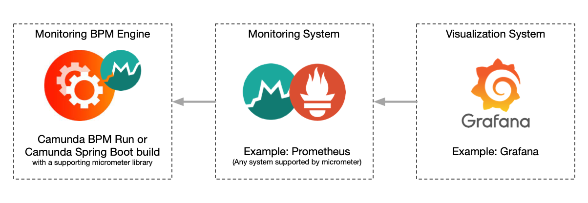

# Camunda Monitoring

"Camunda Monitoring" is a process engine plugin that provides the Camunda BPM engine with configurable and script 
based metric data.

The data can be consumed by numerous monitoring systems such as Prometheus.

This project is a replacement for: https://github.com/StephenOTT/camunda-prometheus-process-engine-plugin


The project leverages Spring Boot Actuator (which leverages [Micrometer](https://micrometer.io/docs)) to 
provide a [generic metrics facade that supports numerous monitoring systems](https://docs.spring.io/spring-boot/docs/current/reference/html/production-ready-features.html#production-ready-metrics)

Due to popularity of Prometheus, this documentation makes the assumption that Prometheus will be used as the monitoring 
system, but you should be able to replace the dependency of Prometheus with any other Micrometer supported system/dependency.

Metric monitoring for a BPM engine can be a resource intensive task depending on the size of your database, 
and your queries/metrics you want to monitor.

This plugin is designed to be used in Camunda run as a drop-in plugin, or as a custom dependency added to your 
Camunda Spring Boot project.



# Camunda-Run Quick Start with Prometheus

1. Download the Camunda-Monitoring Jar from [Releases](https://github.com/StephenOTT/Camunda-Monitoring/releases) and copy it into the docker folder.
1. Configure your DB connections in the default.yml file.   
1. Run the Docker-compose file.  See the docker folder.

The docker-compose will deploy a Camunda-Run instance with the Camunda job-executor disabled.  
The engine instance should be used solely for monitoring purposes.

Defaults:

1. All Spring Boot Actuator metrics that are enabled by default have been disabled and only Camunda metrics should remain.
1. A volume will be mounted for `/metrics/CamundaMonitoringMetrics.groovy`, where you add/remove/modify any metrics you choose.  
1. The Prometheus metrics are exposed at:`http://localhost:8080/actuator/prometheus`
1. Thread Pool (number of parallel threads) for the execution of the scheduled metrics is `3`.  See the `default.yml` for further config options: `spring.task.scheduling.pool.size: 3`


After making changes to the CamundaMonitoringMetrics.groovy file, you must restart the Camunda instance with the 
Camunda Monitoring Plugin for changes to take effect.

For more configuration options on Camunda Run (such as disable Swagger UI, Web Apps, etc) see the [Camunda Docker Repo](https://github.com/camunda/docker-camunda-bpm-platform)

# Prometheus Setup and Grafana Reporting

Deploy any typical Prometheus/Grafana setup with Prometheus configuration as per [Spring Boot Actuator Docs](https://docs.spring.io/spring-boot/docs/current/reference/html/production-ready-features.html#production-ready-metrics-export-prometheus)

# Default Metrics 

Part of `CamundaMonitoringMetrics.groovy`

1. Active Incidents Count (fixedRate = 60s)
1. Active User Tasks Count (fixedRate = 60s)
1. Active Message Event Subscription Count (fixedRate = 60s)
1. Active Signal Event Subscription Count (fixedRate = 60s)
1. Active Compensate Event Subscription Count (fixedRate = 60s)
1. Active Conditional Event Subscription Count (fixedRate = 60s)
1. Executable Jobs Count (fixedRate = 60s)
1. Executable Timer Jobs Count (fixedRate = 60s)
1. Timer Job Count (fixedRate = 60s)
1. Message Job Count (fixedRate = 60s)
1. User Count (fixedRate = 1h)
1. Tenant Count (fixedRate = 1h)
1. Active Process Instance Count (fixedRate = 60s)
1. Completed Process Instance Count (fixedRate = 1h)
1. Active Process Definition Count (fixedRate = 60s)
1. Deployment Count (fixedRate = 60s)
1. Active External Task Count (fixedRate = 60s)
1. Active Locked External Task Count (fixedRate = 60s)
1. Active Not Locked External Task Count (fixedRate = 60s)
1. [Open a request](https://github.com/StephenOTT/Camunda-Monitoring/issues/new) if you want a specific metric created


# Advanced Configuration

## Monitoring Beans Configuration

Monitoring beans are made available to the engine through a "beans configuration" file:

Spring Config Yml Path: `camunda.bpm.metrics.monitoringBeansXml`.  
Default: `file:/camunda/configuration/camunda-monitoring-beans.xml` which is for optimal Camunda Run usage.

Takes a classpath resource or a file:

Example:

`camunda.bpm.metrics.monitoringBeansXml: file:/camunda/configuration/camunda-monitoring-beans.xml`

or

`camunda.bpm.metrics.monitoringBeansXml: /camunda-monitoring-beans.xml` (which would be a xml file in the classpath resources folder)


camunda-metric-beans.xml:

```xml
<?xml version="1.0" encoding="UTF-8"?>
<beans xmlns="http://www.springframework.org/schema/beans" xmlns:xsi="http://www.w3.org/2001/XMLSchema-instance"
       xmlns:lang="http://www.springframework.org/schema/lang"
       xsi:schemaLocation="http://www.springframework.org/schema/beans https://www.springframework.org/schema/beans/spring-beans.xsd
        http://www.springframework.org/schema/lang https://www.springframework.org/schema/lang/spring-lang.xsd http://www.springframework.org/schema/context https://www.springframework.org/schema/context/spring-context.xsd">

    <!--    https://docs.spring.io/spring-framework/docs/current/reference/html/languages.html#groovy-->

    <lang:defaults proxy-target-class="true"/>


    <!--    <lang:groovy id="camundaMonitoringMetrics" script-source="/metrics/CamundaMonitoringMetrics.groovy"/>-->

    <lang:groovy id="camundaMonitoringMetrics" script-source="file:/metrics/CamundaMonitoringMetrics.groovy"/>


    <!--    <lang:groovy id="processInstanceMetrics" script-source="/metrics/ProcessInstanceMetrics.groovy"/>-->
    <!--    <lang:groovy id="incidentMetrics" script-source="/metrics/IncidentMetrics.groovy"/>-->

</beans>
```

`script-source` will look in the classpath by default.  If your groovy files are external to the jar, then you can use the `file:` prefix to set the path in the filesystem such as:

`<lang:groovy id="incidentMetrics" script-source="file:/someFolder/IncidentMetrics.groovy"/>`


## Spring Boot configuration:

Add the following to your Spring Boot Config (such as `application.yml`) .

```yml
# Configure your DB connection:
spring:
  #  datasource:
  #    url: jdbc:h2:./build/DB/dbdevDb1;LOCK_TIMEOUT=10000;DB_CLOSE_ON_EXIT=TRUE # jdbc:h2:~/devDb1;MODE=PostgreSQL;AUTO_SERVER=TRUE
  #    username: sa
  #    password: ''
  task:
    scheduling:
      pool:
        size: 3
        
management:
  endpoints:
    web:
      exposure:
        include: prometheus
  metrics:
    enable:
      jvm: false
      hikaricp: false
      process: false
      logback: false
      tomcat: false
      system: false
      jdbc: false
      http: false

camunda:
  bpm:
    # If you have a custom monitoring-beans path location you can define it:
    #    metrics:
    #      monitoringBeansXml: file:/camunda/configuration/camunda-monitoring-beans.xml
    job-execution:
      enabled: false
 ```

If you want to benefit from the other metrics provided by Spring Boot Actuator then you can enable them under `management.metrics.enable:...`.

See the [Actuator](https://docs.spring.io/spring-boot/docs/current/reference/html/production-ready-features.html#production-ready-metrics-export-prometheus) documentation for further details


# Example Monitoring Metrics File

```groovy

import io.micrometer.core.instrument.MeterRegistry
import io.micrometer.core.instrument.Tag
import org.camunda.bpm.engine.ProcessEngine
import org.springframework.beans.factory.annotation.Autowired
import org.springframework.scheduling.annotation.Scheduled

import javax.annotation.PostConstruct
import java.util.concurrent.atomic.AtomicLong

/**
 * The generic Camunda Monitoring metrics groovy file.
 *
 * This can be used as a quick start catch all file to add any metrics you want to monitor.
 *
 * Advanced use cases may wish to separate metrics into multiple groovy files.
 */
class CamundaMonitoringMetrics {

    @Autowired MeterRegistry registry
    @Autowired ProcessEngine processEngine

    String namespace = "camunda"
    String activeIncidentsMetricName = "${namespace}_active_incidents"

    List<Tag> commonTags

    AtomicLong activeIncidents

    @PostConstruct
    void setup(){
        commonTags = [Tag.of("engineName", processEngine.getName())]
        activeIncidents = registry.gauge(activeIncidentsMetricName, commonTags, new AtomicLong(0))
    }

    @Scheduled(fixedRate = 60000L)
    void getActiveIncidents(){
        activeIncidents.set(processEngine.getRuntimeService().createIncidentQuery().count())
    }
}

```


# Prometheus Output Example

`http://localhost:8080/actuator/prometheus`

```
# HELP camunda_active_process_instances  
# TYPE camunda_active_process_instances gauge
camunda_active_process_instances{engineName="default",} 4.0
# HELP camunda_active_process_instances_metric_execution_duration_seconds How long it took to query the process engine for the camunda_active_process_instances metric
# TYPE camunda_active_process_instances_metric_execution_duration_seconds summary
camunda_active_process_instances_metric_execution_duration_seconds_count{engineName="default",} 0.0
camunda_active_process_instances_metric_execution_duration_seconds_sum{engineName="default",} 0.0
# HELP camunda_active_process_instances_metric_execution_duration_seconds_max How long it took to query the process engine for the camunda_active_process_instances metric
# TYPE camunda_active_process_instances_metric_execution_duration_seconds_max gauge
camunda_active_process_instances_metric_execution_duration_seconds_max{engineName="default",} 0.0
# HELP camunda_process_instances_total  
# TYPE camunda_process_instances_total gauge
camunda_process_instances_total{engineName="default",} 4.0
# HELP camunda_completed_process_instances  
# TYPE camunda_completed_process_instances gauge
camunda_completed_process_instances{engineName="default",} 0.0
# HELP camunda_active_incidents  
# TYPE camunda_active_incidents gauge
camunda_active_incidents{engineName="default",} 0.0
```
